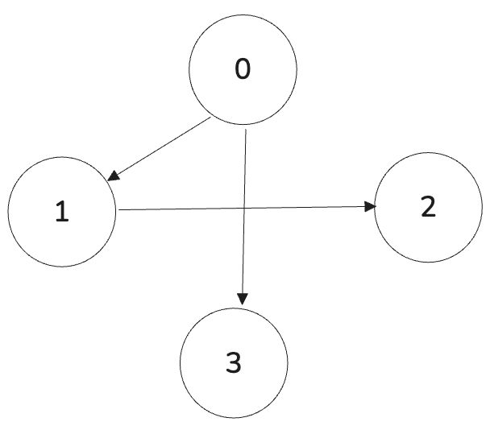

# Topological Sort

The core part for understanding the Manager Priority Queue is to understand the Kahn's Algorithm for Topological Sorting.

It also revolves around a Direct Acyclic Graph (DAG). Below, there are some ways we can represent a graph in coding.

## Edge List

First, we have our graph represented as list of all the edges in the graph.

Each edge is represented as a pair (x, y). So a list of these pairs means a graph.

```
[(0, 1), (0, 3), (1, 2)]
```

The edge list above means:

- We have 4 vertices: `{0, 1, 2, 3}`
- 0 is connected to 1
- 0 is connected to 3
- 1 is connected 2

<div align="center">
  
</div>

## Adjacency List

We can also represen DAG as an Adjacency List.

Here we have two options:

- A hashmap of lists
- A list of lists

The former is more interesting when we label node using strings or a custom identifier. The latter is better when we can label using numbers from 0 to N

If we have N nodes labeled from 0 to N - 1, our Adjancency List has N - 1 positions. While each index represents a N - 1 node, the item in the N - 1 position represents **all vertices adjacent to N - 1**

So the graph in the previous section can be represented as:

```
[[1,3], [2], [], []]
```

Since this is DAG, therefore, the nodes 2 and 3 have empty arrays, since the edge has single direction.
